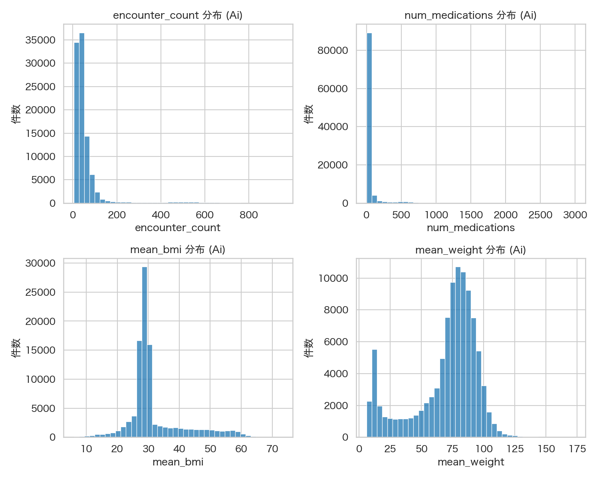
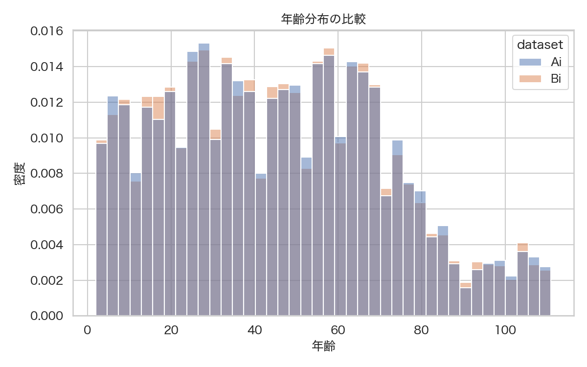
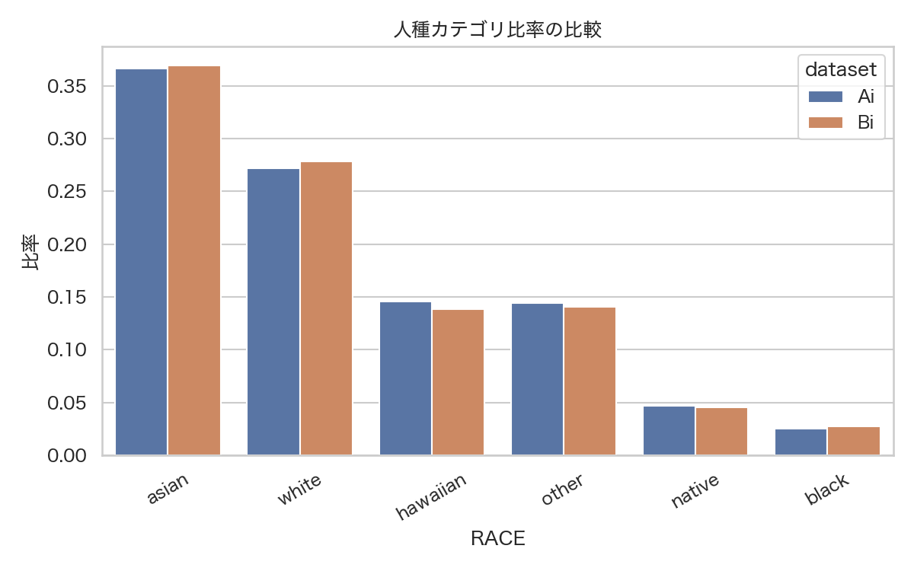
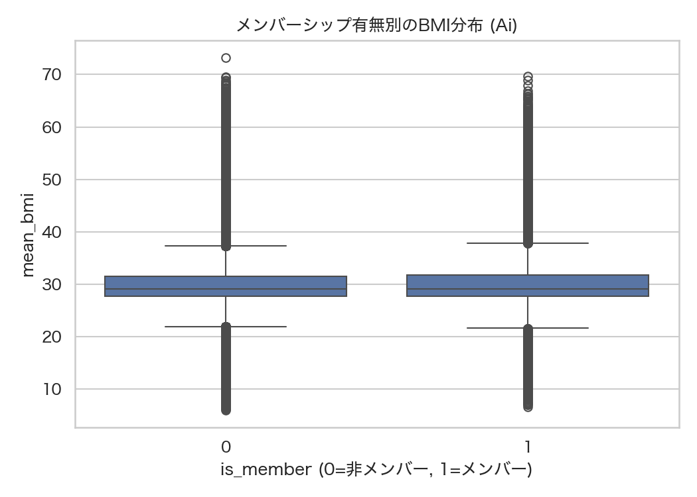

# PWS Cup 2025 データセット EDA レポート

## 1. 対象ファイルと読み込み方法
- `data/HI_100K.csv`（Ai 相当）と `data/HI_10K.csv`（Bi 相当）を pandas で読み込み、UTF-8/BOM を考慮。
- `data/HI_ans.csv` を Ai 行単位のメンバーシップラベル（0/1）として読み込み、Ai に結合。
- `data/columns_range.json` を参照し、値域およびカテゴリ仕様との乖離を検査。

ここで扱う主な列と意味・観測された反例は次の通りです。

| 列名 | 内容 | 観測された特徴・反例 |
| --- | --- | --- |
| GENDER | 性別（F/M） | M が 51.7%、F が 48.3% でほぼ均衡。 |
| AGE | 年齢（整数, 想定 2-110 歳） | 最大 111 歳が 39 件あり仕様超過。高齢帯は 99 パーセンタイルで 108 歳。 |
| RACE | 人種カテゴリ 6 種 | asian 36.6%、white 27.2% が多数派。rare カテゴリは black 2.5%。 |
| ETHNICITY | 民族（nonhispanic/hispanic） | nonhispanic が 89.4%。 |
| encounter_count | 診察回数 | 平均 60.2、最大 951。95 パーセンタイル 156 で長い右裾。 |
| num_procedures | 処置数 | 最大 4,985。上位 1% が 1,798 以上で外れ値寄与が大きい。 |
| num_medications | 処方薬数 | 平均 52.9、最大 2,996。薬剤多用患者がごく一部存在。 |
| num_immunizations | 予防接種数 | 最大 159。中央値 8 で、20 回以上は 8% 程度。 |
| num_allergies | アレルギー数 | 0 が 86.4%、最多でも 18。 |
| num_devices | デバイス数 | 0 が 92.3%、最大 37。匿名化時は 0 の密度維持が重要。 |
| asthma_flag 等 4 フラグ | 疾患有無（0/1） | stroke_flag=1 が 32.6%、depression_flag=1 は 1.0% と稀少。組合せは全 0 が最多。 |
| mean_systolic_bp | 収縮期血圧平均 | 平均 118.7、最大 167.6。上限付近は 0.04% と希。 |
| mean_diastolic_bp | 拡張期血圧平均 | 平均 79.3、最大 124.8。90 以上は 20% 程度。 |
| mean_bmi | BMI 平均 | 平均 31.8、最大 73.21。BMI 60 超は 0.3%。 |
| mean_weight | 体重平均 (kg) | 平均 69.7、最大 173.13。100kg 超は 14.4%。 |

## 2. データ品質チェック
- 欠損値は全列・全データセットで 0 件。
- 仕様外の値は年齢の上限のみ：Ai/Bi ともに最大値 111 が `spec_max=110` を 1 超過。年齢フィールドは切り捨てやクリッピングが必要。
- 仕様チェック詳細は `eda/outputs/tables/range_check.csv` に記録。

## 3. データセット内訳（Ai 中心）
- 行数は Ai 100,000 件・Bi 10,000 件で、Bi が Ai の 10% サブセットであることが `eda/outputs/tables/dataset_overview.csv` から確認可能。
- Ai のカテゴリ分布（`categorical_distribution.csv`）：`GENDER` は男性 51,710 件・女性 48,290 件、`RACE` は `asian` 36,645 件が最多で `white` 27,224 件、`hawaiian` 14,546 件が続く。
- フラグの組合せ（`flag_cooccurrence.csv`）では「全フラグ 0」が 40,361 件（40.4%）と最大で、`stroke_flag=1` 且つ `obesity_flag=1` が 22,487 件（22.5%）と高頻度。
- 数値列のユニーク値は `encounter_count` が 798、`num_medications` が 1,310 など多彩で、匿名化時には高カーディナリティ列の処理（ビニング等）が課題になり得る (`unique_counts.csv`)。

## 4. Ai の主要数値項目分布
- 年齢は 95 パーセンタイル 94 歳・99 パーセンタイル 108 歳、最大 111 と仕様超過分が尾部にのみ存在。高齢層の匿名化では 110 へクリップしつつ尾部の密度低下を補う必要あり。
- `encounter_count` は平均 60.2、中央値 36、95 パーセンタイル 156、最大 951。外来回数が極端な患者は 1%弱なので、Winsorize やビニングにより影響を緩和しつつ情報量を保持したい。
- `num_medications` は平均 52.9、95 パーセンタイル 273、最大 2,996 と特に右裾が長い。薬剤数をカテゴリ分割または対数変換することで匿名化後も代表値を保てる。
- 体格指標は `mean_bmi` 平均 31.8（95 パーセンタイル 53.96、最大 73.21）、`mean_weight` 平均 69.7 kg（95 パーセンタイル 99.85 kg、最大 173.13 kg）。肥満度の高い層が一定割合（約 22%）存在するため、ノイズ付与時も高BMI帯を維持する必要がある。
- 詳細な統計量は `eda/outputs/tables/numeric_summary.csv`、分布可視化は `outputs/figures/ai_numeric_distributions.png` を参照（日本語フォント適用済み）。

## 5. 基本統計の比較（Ai vs Bi）
- 数値列の平均差はすべて 1 未満。最も差が大きいのは `encounter_count` の -0.84（Bi の方がわずかに低い）。
- 偏差や四分位数もほぼ同一で、Bi は Ai の代表サンプルとして振る舞っている。
- 詳細統計は `eda/outputs/tables/numeric_summary.csv` および `numeric_mean_compare.csv` を参照。

## 6. カテゴリ列の分布
- 性別：Ai 51.7% 男性 vs Bi 51.2% 男性と僅差。
- 人種：差分は ±0.7pt 以内。Bi では `hawaiian` がやや少なく `other` がやや多い。
- 民族：nonhispanic 比率が Ai 89.4%、Bi 89.3% とほぼ一致。
- 集計結果は `eda/outputs/tables/categorical_distribution.csv` に保存。

## 7. フラグ系ターゲットの比較
- `stroke_flag` は Ai 32.6%、Bi 32.7% と一致。
- `obesity_flag` は Ai 48.4% に対し Bi 47.4% と 1.0pt 低い。
- `depression_flag` は Ai 1.0%、Bi 1.24% と Bi 側がわずかに高め。
- 全体のカウントと比率は `eda/outputs/tables/flag_prevalence.csv`、複数フラグ同時出現は `flag_cooccurrence.csv` で確認可能（例：全フラグ 0 が 40,361 件、`stroke_flag=1` かつ `obesity_flag=1` が 22,487 件）。

## 8. メンバーシップ構造（Ai × ans）
- `HI_ans.csv` の 1 の総数は 10,000（全体の 10%）。Bi の行数と一致し、Ai 内で Bi を正確に指し示す。
- メンバー行の統計量（`Ai_member`）は Bi と一致しており、Bi が Ai からの単純抽出であることを裏付け。
- 解析用図表：`outputs/figures/bmi_by_membership.png`（BMI 分布に有意差は見られず、中央値が重なる）。

## 9. 今後の解析に向けた示唆
1. 年齢上限 111 の処理方針（110 でのクリップ等）を決定し、匿名化・モデル化前に統一する。
2. 肥満・うつ病フラグで Bi が僅かに偏っているため、推定モデル評価ではこの差分が影響しないか確認。
3. 匿名化処理では右裾が長い `encounter_count`・`num_medications`・肥満指標に着目し、ビニング・Winsorize・ノイズ幅の調整を検討。

---
生成物一覧は `eda/outputs/` 配下に保存済みです。

## 10. 匿名化前処理の素案（スクリプト化）
- `eda/anonymization_prep.py` を追加し、`eda/.venv/bin/python eda/anonymization_prep.py` で年齢クリップと長尾ビニング案を自動生成。
- `age_clipping_summary.json`（`outputs/anonymization/`）では Ai 113 件・Bi 8 件の年齢が 110 に丸められること、元値 111 のみに対処すればよいことを確認。
- `long_tail_binning_plan.json` では `encounter_count` など 4 列の候補ビン境界と Ai/Bi 双方の件数を提示。例：Ai の `num_medications` は `[0, 12, 35, 81, 273, 735, 898, 2996]` で区切ると、上位 0.5% が 898 以上に集中。
- これらの JSON をもとに、匿名化時のノイズ付与やカテゴリ変換を設計できる。調整方針（端点の丸め、ビン統合）は用途に合わせて更新可能。JSON を変更すれば再分析が容易。
