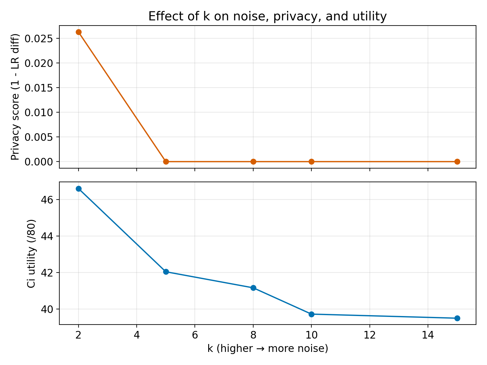

# k 匿名化バリエーション比較 (2025-11-12)

| ディレクトリ | k | stats_diff_max_abs | lr_asthma_max_abs | kw_ind_max_abs | ci_utility (/80) |
| --- | --- | --- | --- | --- | --- |
| `method_k_anonymity_k02` | 2 | 0.2479 | 0.9737 | 0.2000 | 46.61 |
| `method_k_anonymity_k05` | 5 | 0.3129 | 1.0000 | 0.2719 | 42.05 |
| `method_k_anonymity_k08` | 8 | 0.3349 | 1.0000 | 0.2720 | 41.17 |
| `method_k_anonymity` | 10 | 0.3665 | 1.0000 | 0.2808 | 39.72 |
| `method_k_anonymity_k15` | 15 | 0.3665 | 1.0000 | 0.2920 | 39.50 |

## メモ
- 上図のとおり、k を増やすほど（強いノイズ）匿名スコア `1 - lr_asthma_diff` は急速にゼロへ近づき、プライバシー面では不利。k=2 だけが 0.026 とわずかに匿名度を確保している。
- Ci utility は k が小さいほど高く、k=2 で 46.6、k=15 で 39.5 まで低下。ノイズ増加が有用性を直線的に損ねている。
- `stats_diff_max_abs` / `kw_ind_max_abs` も k の増加に伴い悪化しており、現状の単純マイクロアグリゲーションでは「低 k で情報保持・匿名性も一定確保、高 k で双方悪化」というトレードオフが顕著。
- k を下げても `lr_asthma_diff` の改善幅は限定的なので、特徴量ごとに処理を変える・ノイズ種別を追加するなど別軸での匿名化が必要。
- 各バリエーションのログは `experiments/method_k_anonymity_kXX/outputs/logs/` 以下に保存済み。
